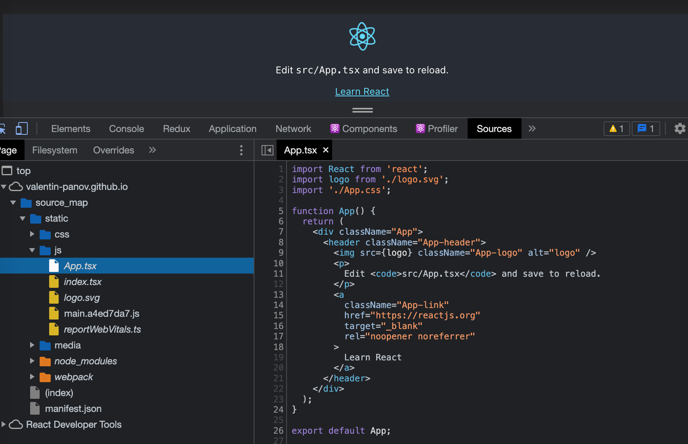
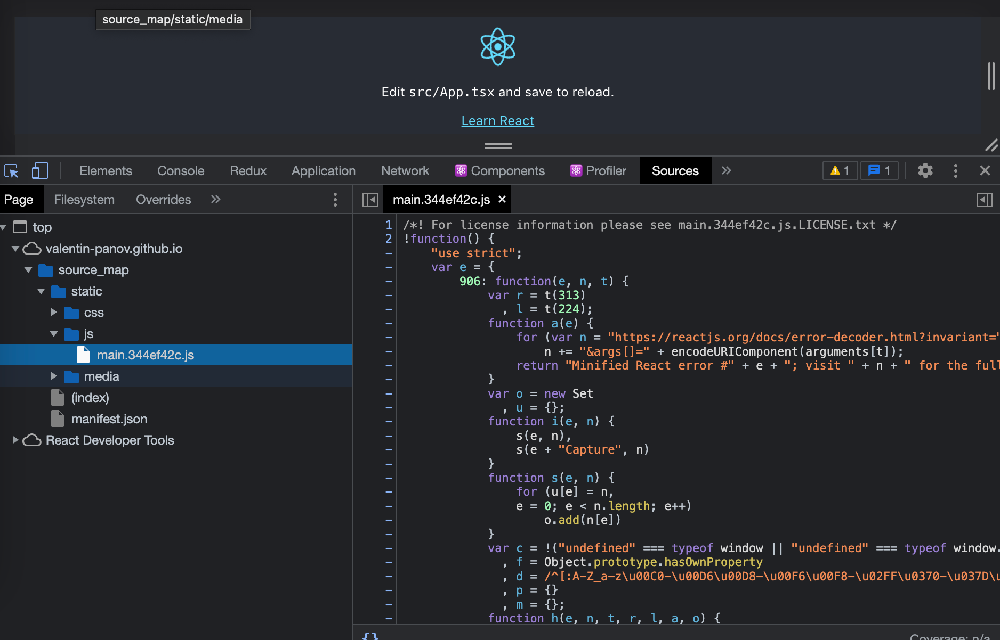

# Restrict the source map generation

[](https://ci.appveyor.com/project/vapanov/source-map)

WEB VERSION: https://valentin-panov.github.io/source_map/

The JavaScript sources executed by the browser are often transformed in some way from the original sources created by a developer. For example:
- sources are often combined and minified to make delivering them from the server more efficient.
- JavaScript running on a page is often machine-generated, as when compiled from a language like TypeScript.

In these situations, it’s much easier to debug the original source, rather than the source in the transformed state that the browser has downloaded.

A source map is a file that maps from the transformed source to the original source, enabling the browser to reconstruct the original source and present the reconstructed original in the debugger.

When we build a project with the default setting, or even if we intentionally turn the source maps on, the whole internet will know our application structure. You can check it here https://valentin-panov.github.io/source_map/. Just open DevTools=>Sources. The source code may be found here.



To prevent such leaks, we need to turn off the source map before pushing the project into production. It may be done in the .env file or directly in the build call string.

```javascript
// package.json
...
"scripts": {
    "build": "GENERATE_SOURCEMAP=false react-scripts build",

```

